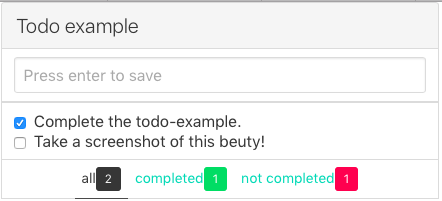

# fuck.js-todo-example
The obligatory todo example.

To run this example, check it out and run ```sbt fastOptJS``` in a terminal and open [index.html](index.html) in a browser.



Here the app is only split over 2 components ([TodoInput](https://github.com/Meduzz/fuck.js-todo-example/blob/master/src/main/scala/se/chimps/fuckjs/example/todo/components/TodoInput.scala) + [TodoList](https://github.com/Meduzz/fuck.js-todo-example/blob/master/src/main/scala/se/chimps/fuckjs/example/todo/components/TodoList.scala)) and only displayes the basics of this frameworks capabilites. But there's easily room to make the tabs its own component.
The two components communicate with messages over the ```UI.trigger()``` + ```UI.on()```.
The app is setup in [Main](https://github.com/Meduzz/fuck.js-todo-example/blob/master/src/main/scala/se/chimps/fuckjs/example/todo/Main.scala) where the components are mounted into the dom.